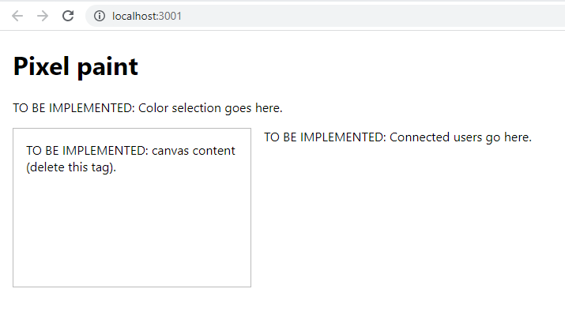

# Pixelwars

This is the beginning of something fun, exploring the world of realtime communication using websockets could lead to very intersting creations.

 
## Running the app

To run it:

- Run `npm install` to install the project dependencies.
- Launch the dev server and express server by running `npm start` and `node server.js` in separate terminals.
- Access the app at [http://localhost:3000](http://localhost:3000).

## coming soon.
